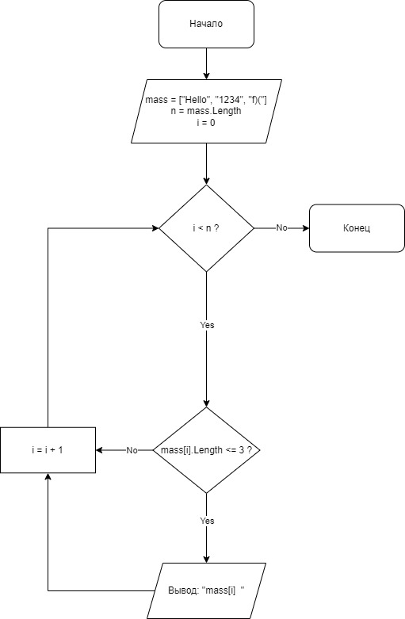

# Описание решения задачи
## Порядок действий
1. Определить __размер__ массива, предварительно задав его:
```sh
string[] mass = ["Hello", "1234", ")()"];
size = mass.Length
```
2. Перебрать все элементы массива, используя счетчик __*i*__, пока выполняется **условие**: 
```
i < size
```
3. Каждый элемент массива проверять на количество символов в нем, и если выполняется следующее условие (ниже), то нужно вывести **mass[i]**:
```sh
mass[i].Length <=3
```
4. **Вне** зависимости от количества символов элемента массива, прибавляем счетчик на 1 и далее **повторяем** те же действия для всех элементов массива:
```sh
i = i + 1
```
5. Под все выше изложенные действия написать соответствующие **функции**(число подходящих элементов массива, подходит ли данный элемент, создание и вывод нового массива)
## Блок-схема решения задачи
